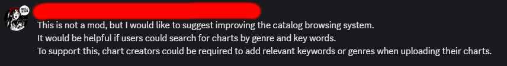
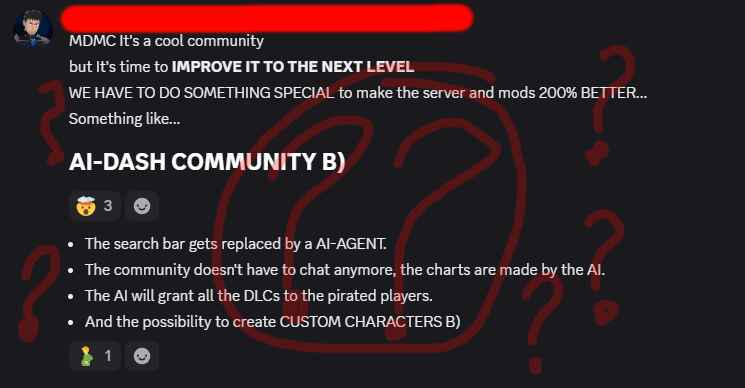
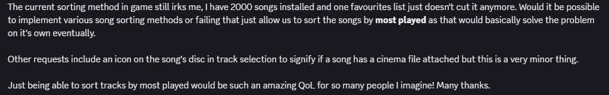
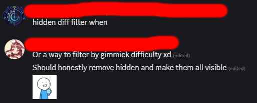

# IronSearch
**IronSearch** is a mod for the hit rhythm game *Muse Dash*.
It modifies the search bar in the song selection, allowing you to quickly find songs by many different criteria, such as BPM, length, difficulty, and more.
It includes a variety of filters and sorting options to help you find the perfect song for your next session.

## Installation
- Download the latest release from the [Releases](../../releases/latest) page.
- Place the zip in your Muse Dash folder root.
- Extract the zip file's contents (such that files in Mods go into Mods, UserLibs into UserLibs)
- Launch the game. First launch may take a while as the mod initializes and pre-loads data.
- Enjoy!

## Feedback form (PLEASE FILL ME)
[I AM VERY IMPORTANT PLEASE FILL ME](https://docs.google.com/forms/d/e/1FAIpQLSevUpaUqkwmkfr6L4F5Zwsc9esofrMk3-MytSN0MSmHZSZhow/viewform)\
**For reporting bugs, open a GitHub Issue instead!**

## Usage
The documentation can be found [here](DOC.md).

## Credits
- The Empress of Potatoes
- The Devil's Agent
- The Fool

## On popular demand

